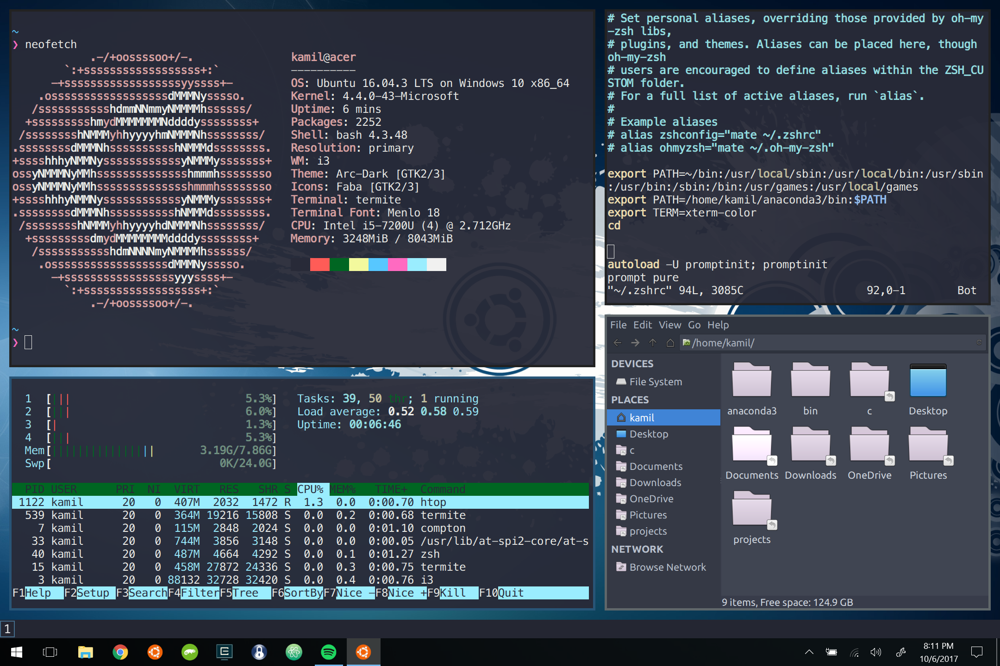
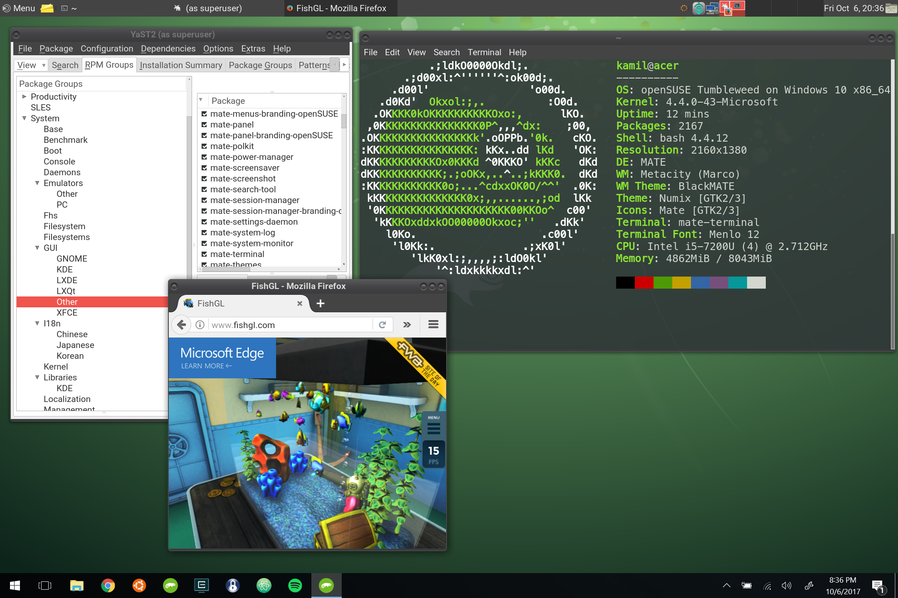

# Launch Linux GUI applications / window managers on Windows

Scripts to launch GUI applications / window managers installed on a Linux distribution from Windows Store.

Requires VcXsrv installed in %programfiles% (e.g. C:\Program Files\VcXsrv).

## Features

- checks if X server is running and automatically launches one
- option to hide cmd window

## Syntax

`run_app.bat/run_app_no_console.bat app_to_lauch window_mode screen_number bash_path pause_cmd_window_at_exit vcxsrv_executable`

Defaults:
- `app_to_launch:               xterm`
- `window_mode:                 multiwindow`
- `screen_number:               0`
- `bash_path:                   %systemroot%\system32\bash.exe`
- `pause_cmd_window_at_exit:    false`
- `vcxsrv_executable:           vcxsrv.exe`

## Tip

For high-DPI displays tick "Override high DPI scaling behavior" and select "Application" in "Compatibility" tab of vcxsrv.exe properties.

## Examples

It is convenient to create a shortcut to either `run_app.bat` or `run_app_no_console.bat`, with "Start in" parameter set to this repository directory and "Target" parameter specifying application to launch, e.g.:

- urxvt terminal on Ubuntu: `cmd /C %userprofile%\projects\WSL-launch-GUI\run_app_no_console.bat urxvt multiwindow 0`
- i3 on Ubuntu: `cmd /C %userprofile%\projects\WSL-launch-GUI\run_app_no_console.bat i3 nodecoration 1`
- mate on openSUSE: `cmd /C %userprofile%\projects\WSL-launch-GUI\run_app_no_console.bat mate-session nodecoration 2 %userprofile%\AppData\Local\Microsoft\WindowsApps\openSUSE-42.exe`

